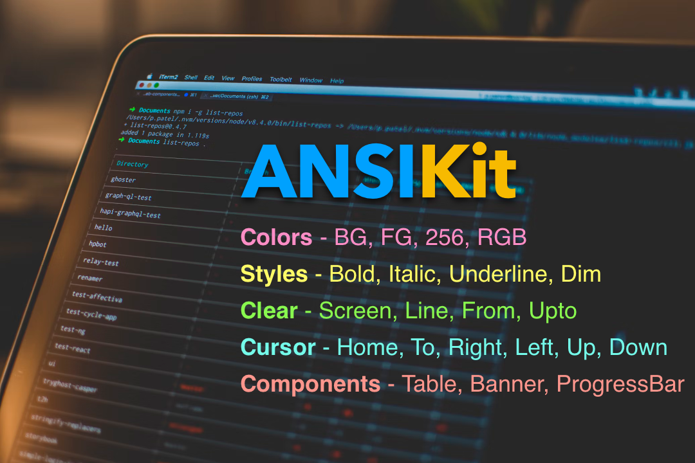

<p align="center">
  
</p>

# AnsiKit

Tiny, Zero-dependency ANSI escape helper for building terminal UIs in PHP. Chainable API for styles/colors/cursor control, with a few handy components (Table, Banner, Progressbar, Spinner) and utilities.

Works any terminal that supports ANSI escapes (most modern terminals on macOS/Linux and Windows Terminal/ConEmu on Windows 10+).

> Let's keep simple things simple. 😌  
> You don't need a _whole framework_ to build a simple CLI app.

## Features

- Colors: Foreground and background colors - standard 8/16 colors, 256-color, and truecolor (RGB, 24-bit)
- Cursor control: movement, save/restore, show/hide, alternate screen buffer
- Components: Table, Banner, Progressbar, Spinner
- Writers: swap output target (stdout or in-memory for tests)
- Helpers: ANSI‑aware string length, simple input (line/multiline/confirm)
- PSR‑12, strict types, DI‑friendly, zero dependencies

## Installation

Requirements: PHP >= 8.1

```bash
composer require ajaxray/ansikit
```

Autoloads via PSR‑4 namespace `Ajaxray\AnsiKit\`.

## Quick Start

```php
<?php
require __DIR__ . '/vendor/autoload.php';

use Ajaxray\AnsiKit\AnsiTerminal;
use Ajaxray\AnsiKit\Components\{Table, Banner, Progressbar};

$t = new AnsiTerminal();
$t->clearScreen()->cursorHome();

$t->writeStyled("Hello PHP Ninja!\n", [AnsiTerminal::TEXT_BOLD, AnsiTerminal::FG_GREEN]);
$t->fg256(202)->bg256(235)->write("256-colors")->reset()->newline();
$t->fgRGB(255,165,0)->write("Truecolor (RGB)")->reset()->newline();

$table = new Table();
$table->setHeaders('Name','Age', 'Adult?')
    ->addRow('Anis','41', '✅')
    ->addRow('Fatima', '2.5', '❌')
    ->render();

$banner = new Banner();
$banner->render('Deploy Complete', '🚀', ['Everything shipped!']);

$bar = new Progressbar();
$bar->renderLine(75, 100, 'Loading files...');
```

## Usage Overview

### Core: `AnsiTerminal`

- Text attributes: `TEXT_BOLD`, `TEXT_UNDERLINE`, `TEXT_STRIKE`, etc.
- Foreground/background colors: standard (`FG_RED`), bright (`FG_BRIGHT_GREEN`), `fg256($n)`, `bg256($n)`, `fgRGB($r,$g,$b)`, `bgRGB(...)`
- Cursor: `cursorTo($row, $col)`, `cursorUp($n)`, `hideCursor()`, `saveCursor()`, `enableAltBuffer()`
- Output: `write($text)`, `writeStyled($text, [..])`, `newline($n)`

Chainable style example:

```php
$t->style(AnsiTerminal::TEXT_BOLD, AnsiTerminal::FG_YELLOW)->write('Warning!')->reset()->newline();
```

### Components

#### Table

```php
use Ajaxray\AnsiKit\Components\Table;

(new Table())
  ->setHeaders('Name','Age')
  ->addRow('Ada', '36')
  ->addRow('Linus', '54')
  ->render();
```

#### Banner

```php
use Ajaxray\AnsiKit\Components\Banner;

(new Banner())->render('Deploy Complete', '🚀', ['Everything shipped!', 'Tag: v1.2.3']);
```

#### Progressbar

```php
use Ajaxray\AnsiKit\Components\Progressbar;

(new Progressbar())
  ->barStyle([AnsiTerminal::FG_GREEN])
  ->percentageStyle([AnsiTerminal::TEXT_BOLD])
  ->labelStyle([AnsiTerminal::FG_CYAN])
  ->borders('[', ']')
  ->renderLine(50, 100, 'Processing');
```

#### Spinner

```php
use Ajaxray\AnsiKit\Components\Spinner;

$s = new Spinner(); // or new Spinner(Spinner::ASCII)
echo $s->next(); // prints next frame
```

### Helpers

#### Input

```php
use Ajaxray\AnsiKit\Support\Input;

$name = Input::line('Your name? [Anonymous] ', 'Anonymous');
$ok   = Input::confirm('Proceed?', true);
$bio  = Input::multiline("Enter bio. End with 'END'", 'END');
```

If the `readline` extension is available, `Input::line()` uses it for line editing/history; otherwise it falls back to `STDIN`.

#### Str

```php
use Ajaxray\AnsiKit\Support\Str;

$plain = Str::stripAnsi("\033[1;31mError\033[0m");
$len   = Str::visibleLength("Styled \033[1mtext\033[0m");
```

### Writers

- `StdoutWriter` (default): writes to `php://stdout` or a provided stream
- `MemoryWriter`: buffer output for tests or capturing

```php
use Ajaxray\AnsiKit\Writers\MemoryWriter;

$w = new MemoryWriter();
$t = new AnsiTerminal($w);
$t->write('hello');
echo $w->getBuffer(); // 'hello'
```

## Examples

Run the example scripts to see things in action:

```bash
php examples/showcase.php   # basic styles, table, banner, bars
php examples/progress.php   # animated status + progress bar
php examples/input.php      # interactive input demo
```

## Tips & Compatibility

- Windows 10+: use Windows Terminal, ConEmu, or enable VT processing for best ANSI support
- Use monospaced fonts for best alignment of box-drawing characters
- Emoji width can vary by terminal; table/banner widths are based on naive visible length

## Contributing

Contributions are welcome! Please:

1. Fork and clone the repo
2. Create a feature branch: `git checkout -b feat/your-thing`
3. Install dev deps: `composer install`
4. Run tests: `composer test`
5. Follow PSR‑12 and keep changes focused
6. Open a PR with a clear description and before/after context

If you change public APIs, update examples and this README. Small, focused PRs are easier to review.

## Roadmap (Ideas)

- ANSI-aware padding/truncation and text alignment helpers
- Color themes/palettes and named styles
- Table cell alignment and per-column styling
- Minimal TUI widgets (prompt list, select, progress spinner lines)

## Versioning & License

- Versioned with SemVer (0.x may include minor BC tweaks)
- Licensed under the MIT License — see `LICENSE`

---

Made with ❤️ for terminal builders. If you ship something with AnsiKit, I’d love to hear about it!

